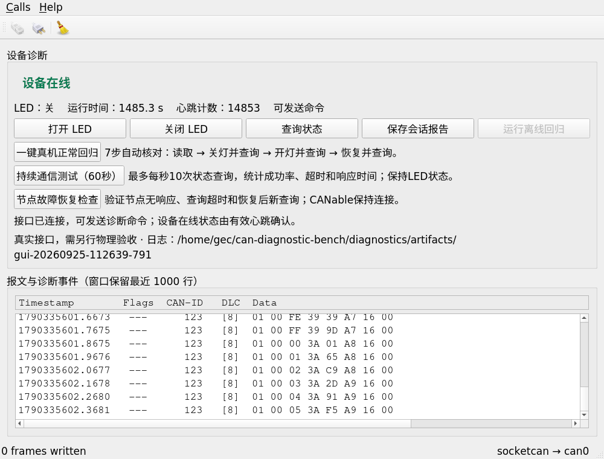

# ESP-Fire Star · CAN设备诊断与自动回归测试台

基于 **STM32F103 + Qt 5 + Linux SocketCAN** 的小型设备联调与测试项目。电脑端发送命令、匹配应答、监测心跳，并自动执行正常回归、持续查询与受控故障恢复检查。

> “ESP-Fire Star”是本仓库名称。当前目标板是野火STM32F103霸道V2，项目不使用ESP32。



上图为2026-09-25发布整理时从实际程序采集：连接真实can0，收到板端心跳，没有发送控制命令。它是程序窗口截图，不是开发板实物照片。更多[实物照片与验证截图](docs/真机证据画廊.md)。

## 能做什么

- 开/关LED、查询设备状态，核对应答格式、操作码和请求序号。
- 100ms目标心跳；500ms未收到有效新心跳提示离线。
- 7步正常回归：读初始状态→关/查→开/查→恢复/查。
- 60秒持续查询：最多10次/秒、单请求在途，完整记录结果及延迟统计。
- 节点停机恢复检查，以及实际USB拔插后的受控恢复验收。
- 原始JSONL报文、JSON/Markdown报告与可重复的vcan故障用例。

## 已有真机结果

| 场景 | 已保存结果 |
|---|---|
| 用户正常回归 | 7/7成功，2.455秒，各3ms |
| 持续查询 | 60.008秒，574/574成功、0超时，平均4.4948ms、P95/最大13ms |
| 节点停机与复位 | DAP暂停约3秒；故障查询超时517ms，恢复后新查询2ms |
| 实际USB拔插 | 用户拔插/VMware分配，can0重建、Qt重连、板端复位后新查询成功 |

这些是具体轮次，不能推导总线饱和性能、长期可靠性或全自动恢复。板端故障会锁存并停发，需要复位。详细证据和历史误判说明见[验收索引](docs/验收与证据索引.md)。

## 文档

| 内容 | 入口 |
|---|---|
| 项目问题、架构、实现和边界 | [初版项目报告](docs/初版项目报告.md) |
| 实物照片、界面截图、拍摄来源 | [真机证据画廊](docs/真机证据画廊.md) |
| 验收结论与原始结果对应关系 | [验收与证据索引](docs/验收与证据索引.md) |
| 构建、接线与日常操作 | [公开仓库复现指南](docs/公开仓库复现指南.md)、[使用与恢复指南](docs/使用与恢复指南.md) |
| 协议与STM32实现 | [协议](docs/PROTOCOL.md)、[固件说明](firmware/stm32-can/README.md)、[HAL集成](firmware/HAL_INTEGRATION.md) |
| 来源、改编和许可边界 | [复用说明](docs/UPSTREAM.md)、[第三方通知](THIRD_PARTY_NOTICES.md) |
| 逐步重建学习 | [REBUILD-MANIFEST](REBUILD-MANIFEST.md) |
| 公开副本处理说明 | [发布说明](publication/README.md) |

## 在Linux上构建

已验证环境为Ubuntu20.04.6、Qt5.12.8、GCC9.4；本次独立副本的构建结果见[发布检查](publication/validation.json)。

```bash
sudo apt install build-essential qtbase5-dev qt5-qmake libqt5serialbus5-dev libqt5serialbus5-plugins can-utils iproute2
bash tools/build.sh
```

已有真实can0可用时：

```bash
./build-app/can-diagnostic-bench --interface can0
```

无需硬件的模拟演示：

```bash
sudo modprobe vcan
ip link show vcan0 >/dev/null 2>&1 || sudo ip link add dev vcan0 type vcan
sudo ip link set dev vcan0 up
python3 tools/run_demo.py
```

固件使用仓库内固定版本厂家HAL，Windows通过`firmware/stm32-can/build.ps1`调用ARM Compiler5构建。没有CubeMX生成的.ioc；厂家uvprojx保留作参考，实际构建入口是脚本。

## 复用与贡献

Qt界面基础来自官方CAN示例，驱动复用SocketCAN和厂家HAL；新增业务协议、诊断判定、测试编排、板级适配与证据归档。用户完成硬件连接及部分操作/现象确认，AI辅助实现、调试、自动验证与文档。运行证据与个人独立掌握程度分别记录。

本仓库保存公开展示副本。个人路径和设备唯一标识已脱敏，原始完整记录及芯片全量备份本地保留；测量数值、失败结果与图片内容没有为了展示而改造。历史报告中的哈希指向本地原件，公开副本哈希见[导出清单](publication/export-manifest.json)。
