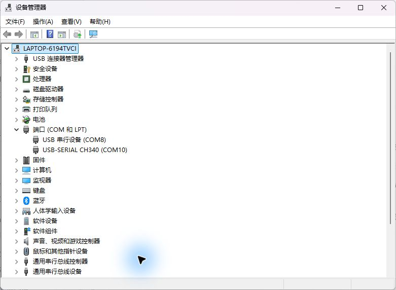

# 开发板供电与USB串口识别

> 公开副本说明：本文件的“原始/原样”描述本地验收档案；此GitHub副本已脱敏个人路径和设备标识，测量值与成功/失败结果保留。图片未改像素。见[发布处理说明](../../publication/README.md)。

> 阶段记录：设备号、进程、窗口状态与“尚未验证”均对应本文件所述当时阶段，不代表现在的待办。2026-09-25初版最终状态见[验收与证据索引](../../docs/验收与证据索引.md)；原始日志、JSON和自动报告保持原样。

日期：2026-09-24。

- 用户操作：按上一步指导连接开发板USB，并报告“灯已经亮了”。指示灯亮为用户口述证据。
- 助手只读检查：Windows中出现 `USB-SERIAL CH340 (COM10)`，VID/PID为1A86/7523，Status=OK、ProblemCode=0，驱动服务为CH341SER_A64。
- 同时仍能识别DAP的CMSIS-DAP HID及CDC串口COM8。COM10属于此次开发板USB串口，COM8属于DAP的附加串口。
- 实际设备管理器画面中同时可见COM8与COM10，已截图归档。

证据文件：[原始系统查询](device-properties.json)、[实际截图](device-manager-com10.png)。

结论：用户报告指示灯亮，Windows正常枚举开发板USB串口。本阶段尚未验证串口数据收发、SWD目标连接、STM32程序运行或CAN通信。下一步确认DAP目标侧针脚标记并接SWD，再建立LED程序基线。

## 用户提供的SWD实物照片与接法纠正

[原始实物照片](user-swd-connectors.jpg)显示：开发板右侧已有白色5针SWD插座；右边的小板为20针JTAG转SWD转接板，其白色插座中接有配套排线。板侧TMS/TCK与转接板的DIO/CLK分别对应同一SWD信号。

当前优先使用完整原厂配套SWD排线，将转接板这一端换插到开发板白色SWD插座，另一端接DAP的对应SWD口。采用原厂指定的同面线并核对定位方向，开发板保持独立USB供电。此前要求拆成四根母对母线、3V3留空属于不适用当前配套线材的默认指导，已纠正，不要求用户拆除原厂线芯。

参考：[野火DAP下载说明](https://doc.embedfire.com/stm32_products/must_read/zh/latest/doc/quickstart/DAP/DAP.html)，明确开发板单独上电、配套SWD排线同面/异面要求，以及普通DAP默认不从3V3脚输出供电。

这张照片未包含排线的DAP端，也不是已接通或已烧录的证据。
