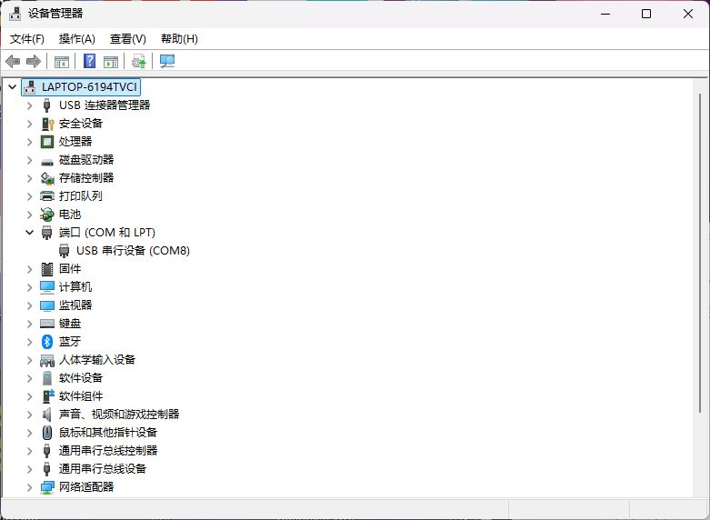

# DAP USB识别记录

> 公开副本说明：本文件的“原始/原样”描述本地验收档案；此GitHub副本已脱敏个人路径和设备标识，测量值与成功/失败结果保留。图片未改像素。见[发布处理说明](../publication/README.md)。

> 阶段记录：设备号、进程、窗口状态与“尚未验证”均对应本文件所述当时阶段，不代表现在的待办。2026-09-25初版最终状态见[验收与证据索引](../docs/验收与证据索引.md)；原始日志、JSON和自动报告保持原样。

日期：2026-09-24。用户将下载器接入Windows电脑后，由助手通过 `Get-PnpDevice -PresentOnly` 及 `Get-PnpDeviceProperty` 只读检查。

| 项目 | 实际结果 |
|---|---|
| USB VID/PID | C251/F001 |
| 复合设备描述 | CMSIS-DAP |
| 调试接口描述 | CMSIS-DAP HID |
| 调试接口类别/驱动服务 | HIDClass / HidUsb |
| 附加串口接口描述 | CMSIS-DAP CDC |
| Windows串口名称 | USB 串行设备 (COM8) |
| 串口驱动服务 | usbser |
| 上述设备状态 | OK |
| 上述设备ProblemCode | 0 |

结论：Windows已枚举出CMSIS-DAP的HID接口及CDC串口，USB数据线支持本次枚举，未显示驱动错误。设备管理器可能显示通用名称“USB输入设备”或“USB Composite Device”，不一定显示DAP型号。

此结果不确认下载器准确硬件版本、目标侧引脚/供电定义，也不证明STM32已连接、SWD通信成功或已烧录。COM8是此设备的附加串口，后续Keil调试选择CMSIS-DAP接口。未执行设备固件修改或目标MCU写入。

## 实际截图与原始查询归档

用户要求“记录，能拍照就拍照”后，已保存以下证据：

- [设备管理器实际截图](dap-usb-2026-09-24/01-device-manager-com8.png)：显示“端口（COM和LPT）”下的“USB 串行设备（COM8）”，无截图标注或拼接。
- [Windows原始设备查询](dap-usb-2026-09-24/02-device-properties.json)：2026-09-24 16:56（UTC+08:00）再次查询，记录同一VID/PID的复合设备、HID和CDC描述、驱动服务、设备状态及ProblemCode。

截图证明当时设备管理器中可见COM8；CMSIS-DAP身份及无错误状态由原始查询记录佐证。此次图片是电脑界面截图，不是开发板实物照片，也不是烧录成功截图。

