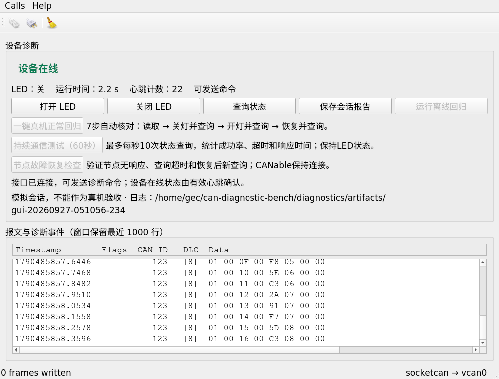

# 修复合并与Ubuntu运行版更新
时间戳：2026-09-27 13:12

[PR #1](https://github.com/Cyw-Elvis-yuwei/ESP-Fire-Star/pull/1)已合并为`67286acbff8828b9f45470de5f23c42c0daa9f95`。Standards与Spec两项独立审查均无阻塞发现，见[审查记录](review.md)。旧v0.1.0仍指向首次发布，固件没有更换。

## 已执行

- 部署前核对52份相关源码/依赖文件，只接受已知基线或修复版，未发现待保留的额外改动。
- 对9份待更新源码/测试和旧GUI/CLI二进制建立备份，备份及原始部署脚本留在本地，不上传完整备份。
- 实际Ubuntu工程更新源码，分别在新构建目录执行qmake和make；四个构建步骤均退出0。
- 两个构建都成功后才替换标准build-app、build-cli位置的程序；安装文件哈希与构建产物一致。
- 在临时用户/网络命名空间的vcan0上启动实际安装的GUI，收到21条有效心跳、0条主动命令、0传输错误、0日志错误，自动退出。CLI --help退出0。
- 测试进程与临时接口已退出；没有启动真实can0会话，没有操作DAP或刷写STM32。

| 产物 | SHA256 |
|---|---|
| 安装后的GUI | `48c6dc1fa4d3555d845796762dc434fe5876cf8715aa315355f7510e05fc3fdd` |
| 安装后的CLI | `f80e7824eb75b4bfc62a3e40c5572eb14ac0f1730dabfce8a42cad40cbdeab5f` |

[部署结果](deployment.json)记录旧文件和新二进制身份；[启动会话](smoke-report.json)是窗口关闭后的快照，connected/online为false不代表截图时没有收到心跳。图中心跳计数是设备字段，接收有效帧数为21，两者不是同一个计数。

## 与完整回归的关系

9月26日已完成同一修复源码的引擎36、正常16、持续15、恢复14项，以及GUI操作和六类vcan回归。本轮比对其9份源码哈希一致，复用已有结果；新增检查针对实际安装位置的构建与启动。没有把既有测试算成本轮重新执行，也没有新增物理CAN验收。

## 实际截图

这是程序原始截图，未重绘、裁切或修改文字。属于vcan模拟，不能作为开发板实物照片或真机收发证据。公开文本只替换个人测试目录，图像原像素保留。

## 后续使用

Ubuntu中仍从既有工程根目录执行`./build-app/can-diagnostic-bench --interface can0`；真实设备使用前按既有指南确认can0及板端状态。程序不会因为Git更新而自动建立真实CAN接口。

原开发目录的完整硬件档案保留，当前维护代码以GitHub main及独立本地仓库为准。若需要回退，先确认当前文件与部署记录一致，再使用对应本地备份；不要用脱敏公开记录代替备份数据。
