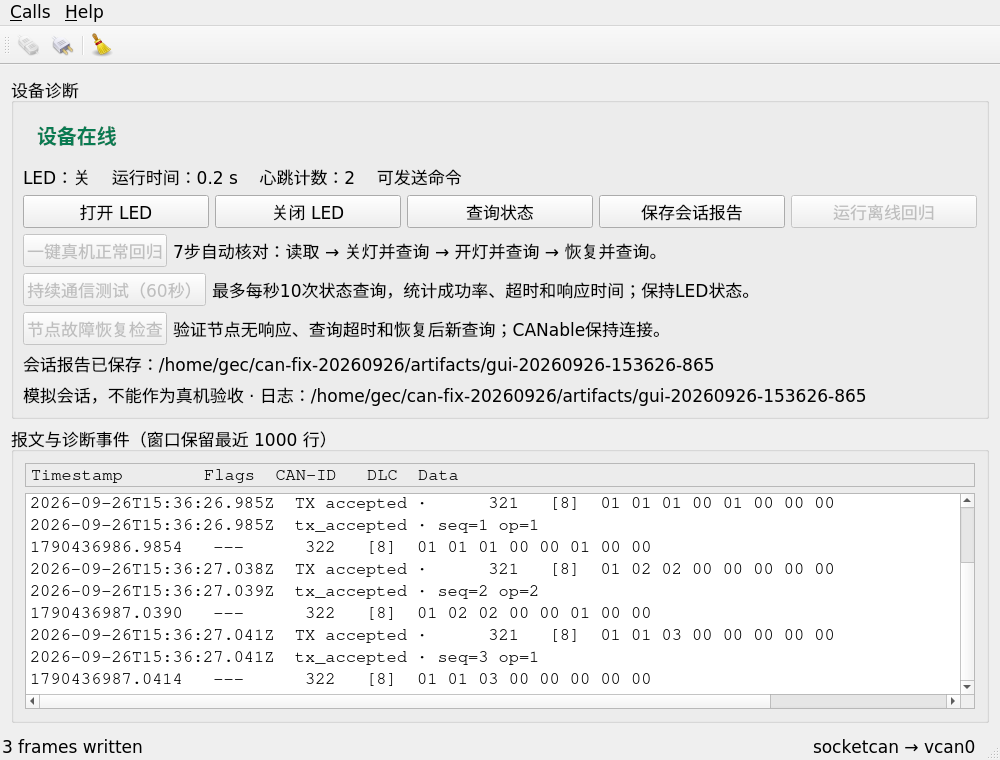

# 日志失败与最终报告保存修复
时间戳：2026-09-26 23:39

## 中文判断提示

- 当前阶段：软件修复和集成回归通过，位于独立修复分支。
- 已确认：发送前日志失败时不再提交；回调中断开/替换请求时不发送旧请求；报告部分写入失败保留能保存的最终数据和错误。
- 证据范围：Qt自动化、真实文件写入错误注入与隔离vcan；没有新烧录、真实CAN收发或物理拔插验证。
- 既有v0.1.0真机记录保持原样，本次软件结果不替代那些硬件记录。

## 1. 发送前失败

旧实现忽略logFrame的写入结果，log_error同步触发NormalRun停止后，sendCommand仍调用sender。准备的同一探针连续两次得到`normal_run_finished → fake_sender_called`，submissions=1；这是本次实际运行结果。

新增内核错误用例只把测试进程自己的临时日志文件描述符替换为`/dev/full`。QFile下一次写入/flush得到真实ENOSPC，旧版同样提交一次。没有改全局资源限制、挂载或设备。

修复让logFrame返回写入结果；已请求但不可用的日志拒绝新命令。发送前同步回调若已断开或替换当前请求，不再提交旧帧。当前请求若尚未交给sender且日志写失败，记录一次log_error结果并清理pending。未启用日志仍可使用；已交给传输层的帧不声称可以撤回。

| 检查 | 旧实现 | 修复后 |
|---|---|---|
| 原NormalRun时序探针 | 两次均1个断言失败，停止后仍提交一次 | 3 passed，submissions=0（含init/cleanup） |
| 扩展引擎测试 | 30 passed / 4 failed，含ENOSPC、坏日志及回调断开 | 最终36 passed / 0 failed |
| 后续补充边界 | 新请求替代旧请求、sender被移除 | 均通过；不误发旧帧或抛空函数调用异常 |

[旧探针](prepared-repro-red.log) · [重复旧探针](prepared-repro-red-repeat.log) · [合并后的探针](prepared-repro-integrated.log) · [引擎红测试](engine-red.log) · [最终引擎测试](engine-final.log)

## 2. 报告保存失败

NormalRun/ContinuousRun原先在Markdown失败后提前返回，JSON停留在开始时的快照；RecoveryRun先写JSON再设置错误，磁盘缺少保存失败原因。现在分别尝试保存，先记录已知错误，只在两份都成功时报告完整保存成功。JSON本身不可写时不能承诺落盘，只能保留内存/界面的错误状态。

详见[单独红绿证据](../report-audit-2026-09-26/README.md)。

## 3. 两组修改合并后的验证

Ubuntu20.04 / Qt5.12.8，独立构建目录。GUI、CLI以及相关测试均重新构建通过；四套逻辑测试为引擎36、正常16、持续15、恢复14，全部0失败，计数含init/cleanup。

在`unshare -Urn`临时用户/网络命名空间中创建vcan0并运行实际GUI控件测试。GUI完成开灯/查询/关灯、保存报告、断开和离线回归；CLI六组normal、response-timeout、wrong-seq、late-response、heartbeat-timeout、restart均通过。命名空间结束后其虚拟接口消失，宿主Ubuntu接口与真实CAN不受改变。

- [逐命令退出码](integration-evidence/results.json)
- [GUI自动化日志](integration-evidence/test-vcan-gui.log)
- [六类vcan汇总](regression-20260926-153627-088/summary.md)
- [修改源码SHA256](source-sha256.json)

图中为vcan模拟，不是真机照片。Qt离屏插件提示保留在日志中。公开日志仅替换个人测试目录，不改通过/失败和耗时。

## 4. 复现与回归

工程根目录已有qmake、make、QtSerialBus/QtTest时，可分别构建tests/tests.pro、normal.pro、continuous.pro、recovery.pro。原始最小探针位于repro：设置CANBENCH_SOURCE为待测工程根目录后，用qmake构建log_failure_ordering.pro。假发送器探针不需要任何CAN接口。

GUI整合检查需要隔离vcan或明确的测试vcan环境；不把故障注入脚本指向真实can0。新测试不修改协议、STM32固件、USB适配器或烧录脚本。
