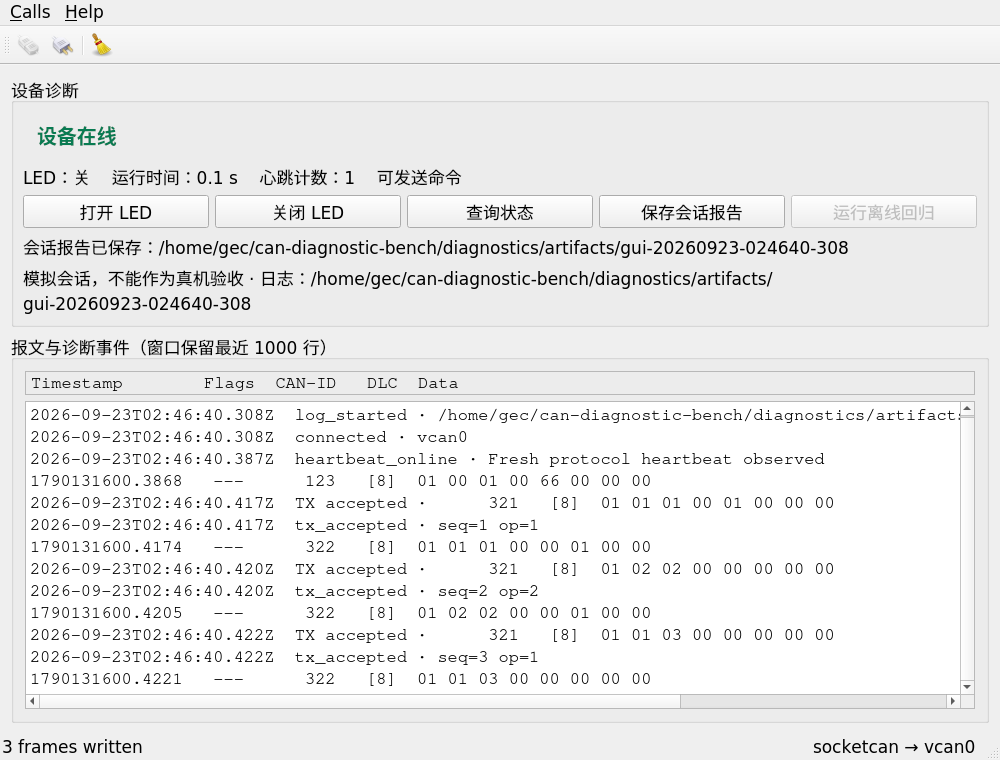

# 2026-09-23 软件阶段验证记录

> 历史快照：本报告仅记录2026-09-23的软件和vcan验证。当时的“未验证”与操作建议保留用于追溯，不作为今天的待办。后续ARM、烧录及物理CAN结果见[最终证据索引](验收与证据索引.md)。

结论：硬件到货前的软件版本已构建并通过下面的实际测试。所有总线集成场景都使用虚拟CAN，`hardware_verified=false`。

## 执行环境

- 用户已有VMware Ubuntu 20.04.6，内核5.4.0-216-generic。
- Qt/qmake 5.12.8、GCC9.4；复用已安装的can-utils和Qt SocketCAN插件。
- 实施目录：`/home/demo/can-diagnostic-bench/diagnostics`。
- 用户建立vcan0，随后实际查询得到 `linkinfo.info_kind=vcan`、`UP`、`LOWER_UP`。
- 原 `/home/demo/can-diagnostic-bench/can` 与 `build` 未作为写入目标。

## 文件与功能

GUI沿用Qt官方示例的SocketCAN接入及界面基础，新增长期心跳观察、LED控制、状态查询、命令序号匹配和会话报告。GUI与CLI使用同一个诊断引擎；Python模拟节点只模拟对端协议，不代替主机判定逻辑。

请求与应答各有独立ID，最多一个在途命令；超时后必须使用新序号，迟到/错序回包不能记到下一条命令。JSONL日志保留帧与事件，JSON/Markdown报告保留计数和最近命令结果。GUI只保留1000行，报告只保留最近256条命令，完整运行证据在日志中。

## 实际自动化结果

| 层次 | 结果 | 证据 |
|---|---|---|
| GUI、CLI、核心测试编译 | 成功 | [构建及核心测试日志](../artifacts/build-2026-09-23-final.txt) |
| Qt核心逻辑 | 28 passed / 0 failed，含初始化/清理 | 同上 |
| 可移植C固件业务层 | 139项检查通过，x86原生运行 | 同上；不是ARM编译 |
| vcan端到端 | 6/6通过 | [回归汇总](../artifacts/acceptance-2026-09-23/summary.md) |
| Qt界面控件与vcan集成 | 业务用例通过；Qt总计3 passed含初始化/清理 | [GUI测试日志](../artifacts/gui-tests-2026-09-23.txt) |
| 非vcan拒绝、旧报告保护、进程清理 | 4项检查通过 | [检查原始结果](../artifacts/guardrails-2026-09-23.json) |

6个总线用例的具体检查：

1. 正常收发：开灯、查询确认开、关灯、查询确认关。
2. 应答超时：丢弃第一条应答，主机记录超时，新序号查询成功。
3. 心跳超时：暂停心跳但仍回复查询，应答不能把设备冒充为在线；心跳恢复后新查询成功。
4. 重启观察：模拟运行时间和心跳计数复位，主机记录迹象；随后新查询确认LED恢复到默认关。
5. 错误序号：收到错误序号应答仍保持原请求等待，最终超时；新查询成功。
6. 迟到应答：上一条应答在新请求等待时到达，被拒绝；新请求须等自己的应答才成功。

界面测试实际点击Qt控件：开灯→查询→关灯→保存报告→断开→运行离线回归。它检查按钮状态、成功结果、报告文件、回归结束状态，以及回归运行中关闭窗口不会留下子进程。GUI内启动的回归汇总在 `artifacts/regression-20260923-024640-467/`。

## 当前会话观察

实际离屏渲染截图已打开检查：中文可读、设备在线、LED关、发送3帧、匹配应答和报告路径可见。



这是自动测试实际运行的Qt界面截图，不是设计稿；它仍不能替代用户在Ubuntu桌面上的体验验收。

## 本轮修正与保留记录

- Qt5.12没有测试初稿使用的 `QCanBusFrame::FrameId` 名称，改用实际接口返回类型 `quint32`。
- 测试信号参数索引偏移已修正，读取的成功结果和延迟字段与5参数信号一致。
- 连续两帧普通旧心跳曾可能触发重启观察，现限定启动窗口并增加旧帧不刷新存活的回归测试。
- 首次编译失败和中途测试失败的日志仍保留，最终结果以 `build-2026-09-23-final.txt` 为准。

## 截至2026-09-23尚未验证（历史）

- 用户亲自在桌面使用新增GUI；目前用户亲验的是之前的Qt官方示例。
- STM32工程的ARM构建、实际下载、调试器、板上LED以及CAN收发器。
- CANable固件/USB透传、CANH/CANL/GND、供电跳线、120Ω/60Ω电阻和500kbps总线。
- 真实设备复位、拔插、bus-off等物理故障。

v1没有boot ID，重启探测存在保守启动窗口；不承诺所有复位都可辨认。没有执行长时间压力或实际总线负载测试，也不宣称硬实时或产品级可靠性。

## 当时的用户下一步（历史）

在Ubuntu终端执行：

```bash
cd ~/can-diagnostic-bench/diagnostics
python3 tools/run_demo.py
```

依次点“打开LED”“查询状态”“关闭LED”。应能看到LED状态随匹配应答改变，命令显示成功。这里的LED是模拟节点状态。关闭窗口后启动器会清理自己启动的模拟节点。

源码与报告也保存在Windows `$LOCAL_PROJECT`。后续硬件阶段沿用相同协议与引擎，不重新选择硬件。
