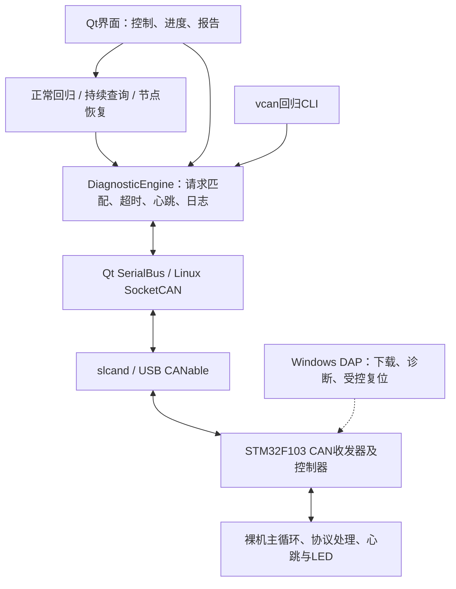
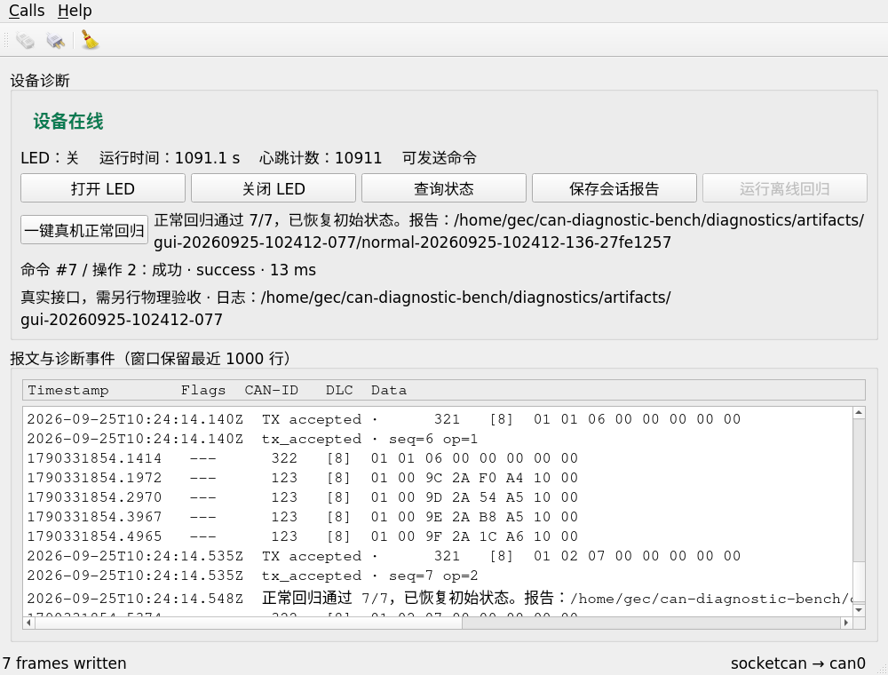

# CAN设备诊断与自动回归测试台——初版项目报告

文档日期：2026-09-25。报告基于已有源码和验收档案整理；本次文档修订没有重新构建、运行或刷写设备。初版已完成约定功能及真机验证，属于学习与求职展示用的小型联调工具。

## 1. 解决的问题与使用者

使用者是对嵌入式设备进行开发、联调和测试的人。对一个CAN节点，常见检查需要反复发送命令、找出匹配回复、核对返回状态、观察设备是否还在线，并在失败后留下能够回看的记录。

本项目将这些检查组织为可重复执行的流程：人工控制用于观察；正常回归用于重复验证；持续查询用于记录一段时间的通信表现；故障恢复检查用于确认故障被识别且恢复后新请求确实成功。LED提供一个可直观看到的被测功能，项目重点是通信判定、测试编排与联调证据。

没有客户部署、生产线使用或量化节省工时的记录，不宣称商业落地或提升某个百分比的效率。

## 2. 系统结构

Linux运行在现有VMware Ubuntu中，STM32运行裸机固件。DAP负责下载/调试，CANable负责业务CAN通信，两者用途不同。虚拟测试使用vcan和Python节点，不接入真实执行器；CLI故障回归保留仅vcan限制。

## 3. 环境与硬件

| 项目 | 本项目实际采用 |
|---|---|
| 目标平台 | 野火霸道V2，STM32F103ZET6，512KB Flash、64KB内部RAM |
| 主机环境 | VMware Ubuntu20.04.6，内核5.4.0-216-generic，Qt5.12.8，GCC9.4 |
| 调试环境 | Windows；ARM Compiler5.05；CMSIS-DAP/pyOCD |
| CAN接入 | MKS CANable V2.0，现有SLCAN固件，500kbit/s经典CAN |
| 固件配置 | HSE8MHz、PLL×9、HCLK72MHz、APB1 36MHz；PB8 RX、PB9 TX |
| 物理连接 | CANH↔CANH、CANL↔CANL、GND↔板上J13 GND；J40供电跳帽 |
| 终端 | 板载固定120Ω加CANable启用120Ω；用户断电实测59.4～59.5Ω |

时钟为源码配置和可工作的通信组合，未用外部仪器测量晶振精度或位时序。电阻正常不能单独证明极性、接地或协议正确。

## 4. 模块与实现

| 模块 | 职责与设计选择 |
|---|---|
| DiagnosticEngine | GUI/CLI共享的判定核心；同一时刻最多一条命令在途，核对帧格式、版本、操作、序号、结果及状态；500ms默认超时 |
| 心跳监测 | 100ms目标心跳；500ms无有效新心跳判断离线；重复/普通旧帧不刷新在线时间 |
| NormalRun | 查询初始LED→关/查→开/查→恢复/查；每步成功再继续，正常结束恢复初始状态 |
| ContinuousRun | 60秒GET_STATUS；发送间隔至少100ms；记录全部本轮样本、成功率、超时及成功回复延迟 |
| RecoveryRun | 正常查询→离线→预期查询超时→有效心跳→新查询成功；不自行制造故障或复位 |
| 固件业务层 | 可移植C协议与心跳逻辑，不直接依赖Qt或HAL |
| 固件适配层 | 旧HAL CAN、中断收帧入队、前台处理、回复优先、有限队列、单个发送在途和故障停发 |
| 报告 | 原始JSONL、会话JSON/Markdown及每轮独立结果；原始失败记录不被后续通过结果覆盖 |

固件RX环形队列16槽、有效容量15，回复队列8槽，前台单轮最多处理4帧；心跳只保留最新待发候选。中断收帧复制数据和记录事件，主要业务在主循环处理。使用WFI等待中断，无RTOS、动态业务内存分配或阻塞发送。

## 5. 协议与判定

首版为单节点自定义协议，非UDS、CANopen或标准汽车诊断协议。三类标准11位经典CAN帧均为8字节：

| ID | 用途 | 数据概要 |
|---|---|---|
| 0x321 | 请求 | 版本、操作码、16位序号、参数 |
| 0x322 | 回复 | 版本、原操作码、原序号、结果、LED状态 |
| 0x123 | 心跳 | 版本、LED、16位计数、32位运行时间 |

SET_LED使用明确的开/关设置；GET_STATUS读取状态。发送接口接受请求后，仍需匹配回复才判业务成功。超时后的新请求使用新序号，迟到回复不能完成新请求。详细字节与限制见[协议v1](PROTOCOL.md)。

## 6. 已验收效果

| 场景 | 实际结果 | 证据层次 |
|---|---|---|
| ARM固件 | BIN7044字节，静态RAM2232字节；备份后窄范围下载、全Flash及选项字节校验 | 构建/下载/独立运行核验 |
| 手动真实GUI | 用户操作报告10条命令全部成功，含复位后的新查询 | 用户操作＋原始报文 |
| 一键正常回归 | 用户一轮7/7成功，2.455秒，各3ms；当前板端PB0与查询状态一致 | 用户点击＋报文＋DAP寄存器 |
| 持续查询 | 60.008秒，574/574成功，0超时；平均4.4948ms，P95/最大13ms | 助手自动Qt控件＋实际CAN |
| 节点无响应 | DAP暂停约3秒；查询预期超时517ms，复位后新查询2ms成功 | 真实节点故障注入＋报文 |
| USB断开恢复 | 用户拔插并重新分配给Ubuntu；can0编号4→5；板端复位后新会话查询2ms成功 | 人的物理动作＋工具恢复 |

超时500ms是判定阈值，日志中的517ms含主机调度延迟。持续测试是约9.565次/秒的一分钟查询，不是CAN总线饱和压力测试。细项、测试数量及原始文件见[验收与证据索引](验收与证据索引.md)。

下面是正常回归阶段由QtTest实际操作程序、连接真实can0取得的原始界面截图：显示7/7通过并恢复初始LED状态。它对应助手自动运行的一轮，末条13ms；上表各3ms对应另一次用户运行，两轮不能混用。

## 7. 真实问题与处理

- **网络路径错误**：Ubuntu原默认路由走不可达的ens33网关，影响包安装；切到可用NAT路径后恢复。后续不把DNS报错一律当镜像源问题。
- **DAP读取卡住**：完整Flash读取曾停在192KB；恢复调试通道并限制CMSIS-DAP在途包后，两次512KB读取一致。底层原因未被唯一证明。
- **SLEEPING误判**：固件WFI时调试器可报告SLEEPING；原下载器仅接受RUNNING，造成历史结果false。完整读回、独立运行核验和真实通信共同确认后续成功，未篡改旧结果。
- **真实SLCAN误标模拟**：Qt5.12按sysfs路径判断虚拟设备，误把真实SLCAN识别为模拟；改按ip链路类型区分，并测试了改名为can0的vcan。
- **插回USB仍不能通信**：适配器归属、can0、Qt连接和板端状态分别检查；实读ACK错误及fault4后，SYSRESETREQ使板端重新工作，新查询证明恢复。

## 8. 复用、贡献与学习边界

Qt界面基础来自Qt5.12.8官方CAN示例，Linux CAN驱动/SocketCAN及can-utils直接复用，STM32 HAL/CMSIS/启动文件来自固定厂家提交。新增工作集中在自定义业务协议、判定核心、测试编排、板级适配、日志和恢复验证。原版权通知和来源清单保留，详见[复用说明](UPSTREAM.md)。

用户完成实物连接、必要的本地管理员输入及部分界面/灯状态确认；助手辅助了代码、构建、自动化、诊断和报告。项目运行证据不代表用户已独立掌握实现。简历宜作为小型专项，说明实际参与；不写自研CAN驱动、客户落地、工业级平台或未验证的全自动恢复。

## 9. 初版限制与后续

- 一台被测节点、一个主动命令端；业务为LED控制/状态查询。
- CAN故障锁存停发，恢复需复位；USB流程包含物理拔插、VMware分配、脚本与DAP配合。
- 节点恢复按钮不处理适配器消失；USB用例有独立协调程序和证据。
- 心跳协议无boot ID，保守重启判断不能保证识别所有复位，也不能完全区分历史启动帧重放。
- 无认证、CAN FD、多主机业务仲裁、Bootloader、升级、掉电参数保存或长期可靠性结论。
- 本报告的项目内容已整理为独立公开仓库；发布副本检查及省略材料见[发布说明](../publication/README.md)。

ADC/传感器、曲线、参数保存和网络功能属于未来版本，不影响初版已完成。下一步可用[使用指南](使用与恢复指南.md)演示，并沿“按钮→请求→板端处理→回复→判定”学习关键代码。
