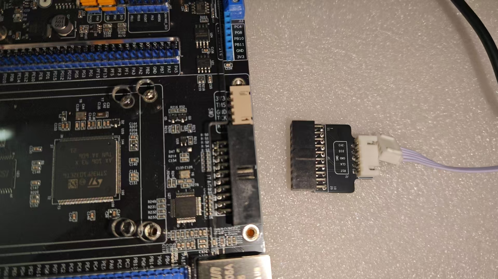
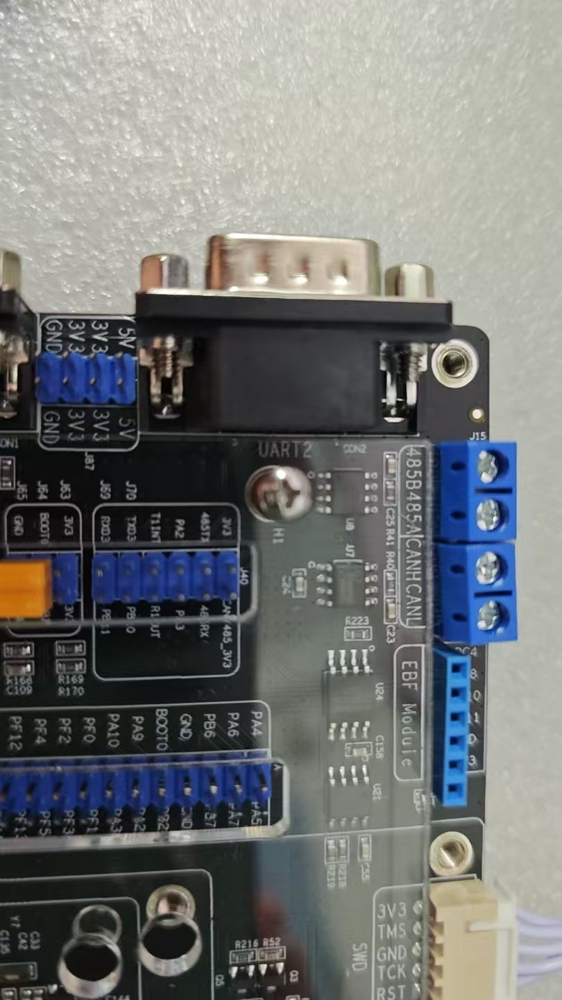
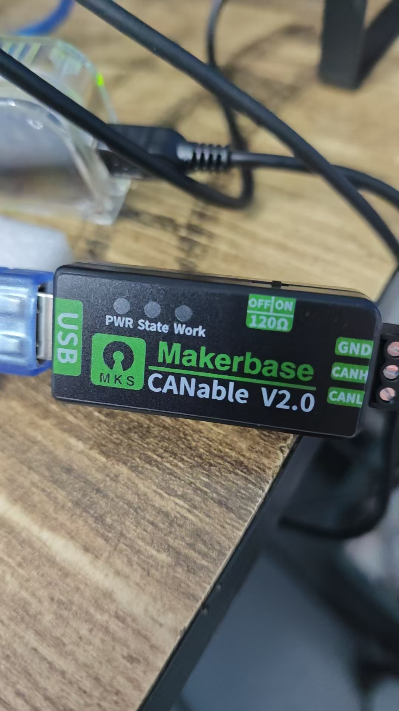
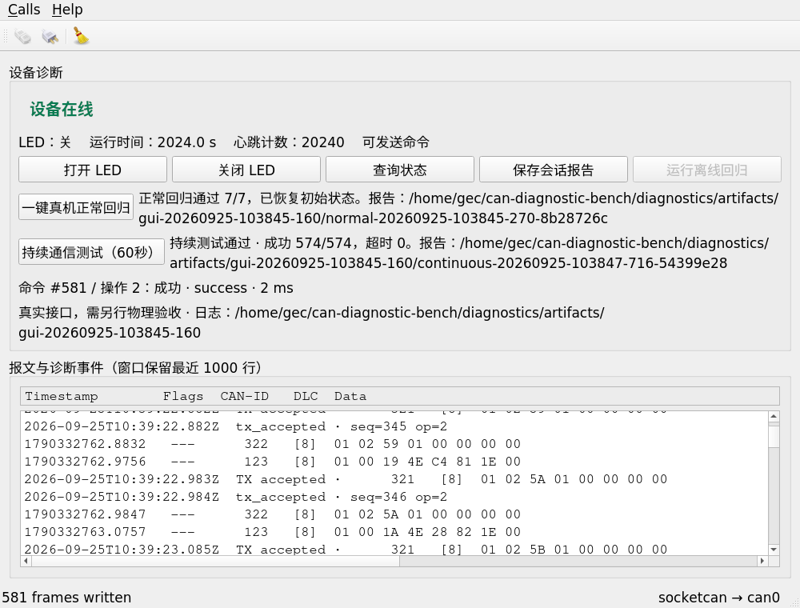
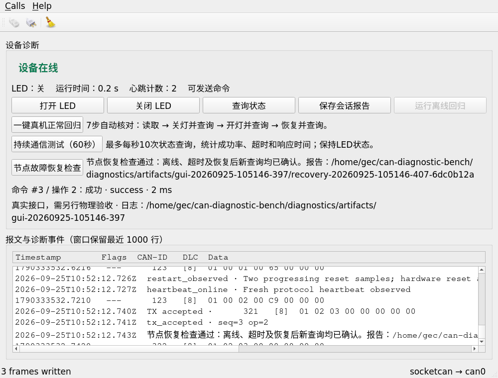
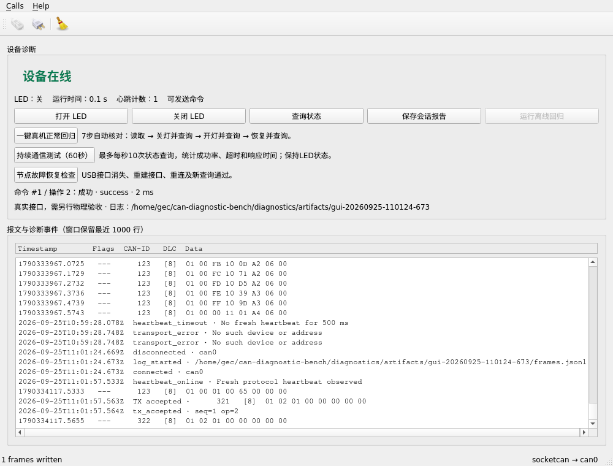
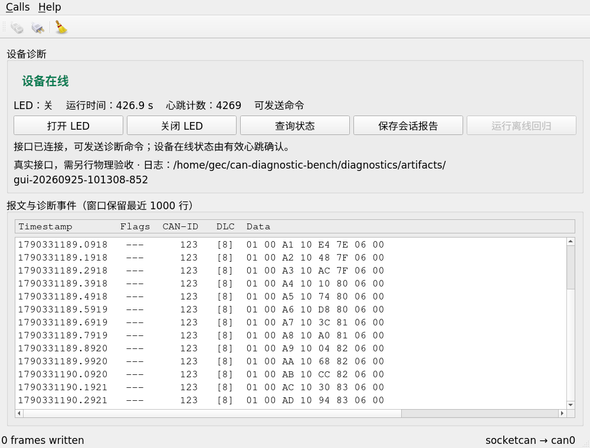
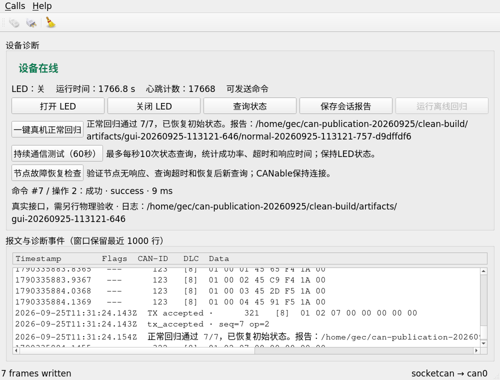

# 实物照片与真机验证画廊

图片均为用户提供的实物照片或程序实际截图，没有AI生成、补画文本或伪造设备画面。照片记录的是各自时间点；历史接线图不能冒充最终接线完成图。界面截图保留原像素，可能显示实验账户目录名；文本证据另有脱敏说明。

## 实物照片

### 原厂SWD插座与配套排线

用户提供的实物照片；当时转接板仍在旁边，不代表最终完整连线或CAN验收。

### 开发板CAN端子与J40区域

用户提供的阶段照片；J40跳帽后续由用户确认插好，不能单凭此图推断电阻已接通。

### CANable接口与120Ω开关

用户提供的实物照片；显示接口和开关标识，不是总线收发证据。

## 真机程序截图

### 发布时的真实心跳在线

本次新采集；真实can0，26条有效心跳，0条控制命令。

### 正常回归7/7

QtTest操作真实控件并接真实can0；该自动轮次末条13ms，与另一次用户各3ms的报告分开。

### 持续查询574/574

60.008秒实测。

### 节点停机后恢复

DAP受控暂停及复位，不是物理拔线。

### 实际USB拔插恢复

用户实际拔插与VMware分配，脚本和DAP配合恢复。

### 真实SLCAN分类修复

只接收真实心跳，验证接口分类，未代替用户操作。

### 发布副本重新构建后的真实7步回归

本次用独立发布源码在Ubuntu重新构建，并连接现有真实can0完成7/7，正常结束恢复原LED状态；无烧录、无拔插。结果见[本次日志](../publication/normal-release-test.log)。

## 设备识别截图

- [DAP枚举](../artifacts/dap-usb-2026-09-24/01-device-manager-com8.png)
- [开发板CH340枚举](../artifacts/board-usb-2026-09-24/device-manager-com10.png)

它们只能证明当时USB识别，不单独证明固件运行。

## 模拟截图（单独分类）

- [最初GUI](../artifacts/gui-smoke-initial.png)、[按钮验证](../artifacts/gui-buttons-2026-09-23.png)
- [模拟开灯](../artifacts/user-demo-2026-09-24/01-user-led-on.png)、[查询](../artifacts/user-demo-2026-09-24/02-user-query-status.png)、[关灯](../artifacts/user-demo-2026-09-24/03-user-led-off.png)
- [模拟超时](../artifacts/user-demo-2026-09-24/04-user-timeout.png)、[恢复后新查询](../artifacts/user-demo-2026-09-24/05-user-recovered-query.png)、[保存报告](../artifacts/user-demo-2026-09-24/06-user-report-saved.png)

## 尚没有的影像

没有最终完整三线接好后的全景照片、万用表59.4～59.5Ω读数照片或全过程物理LED录像。上述事项的用户文字反馈、报文及寄存器证据分别存在，但不会被描述为相机拍摄。发布时无法通过现有工具取得新的板端相机画面；不影响已完成的通信验收，也不生成图片代替。

全部图片索引见[图片清单](../publication/images.json)，结果追溯见[验收索引](验收与证据索引.md)。
